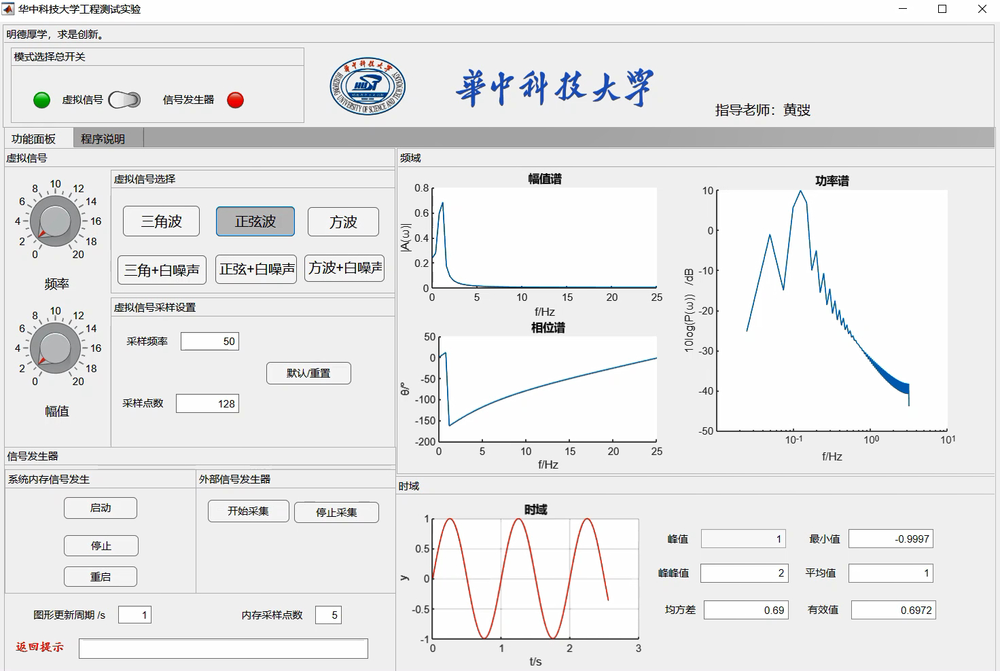
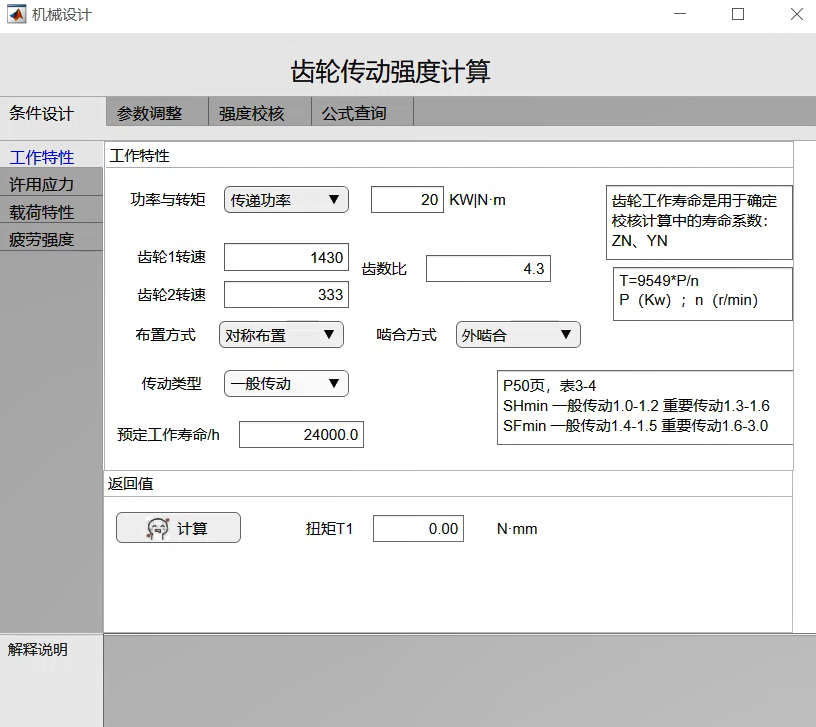
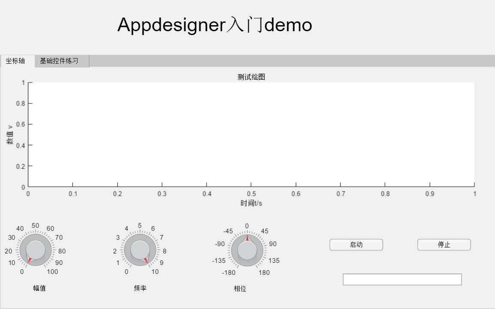
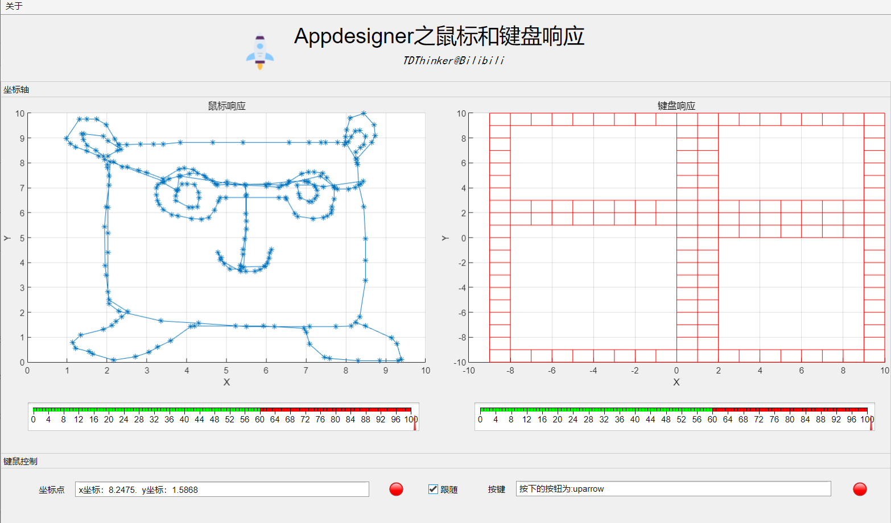
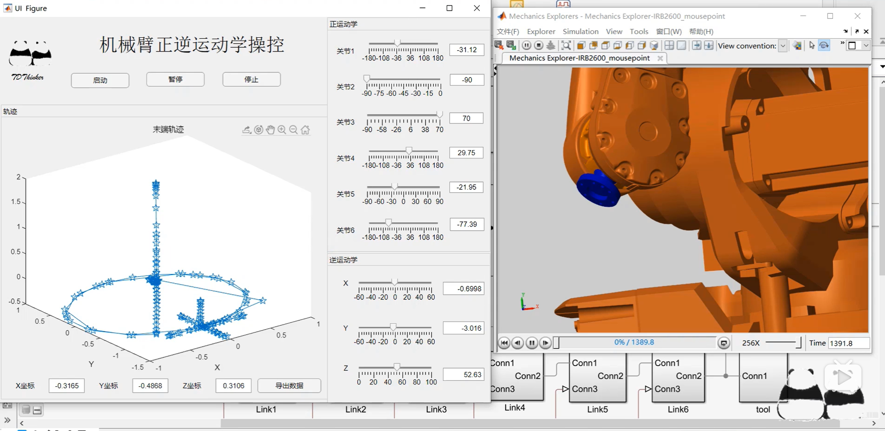
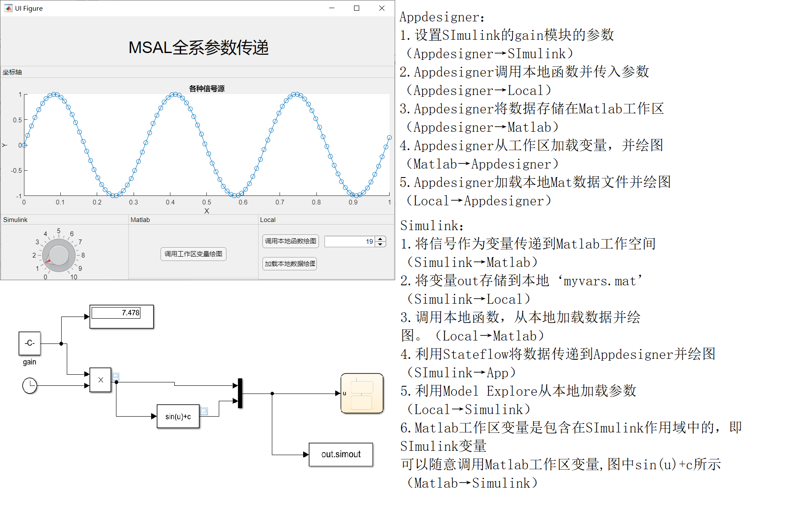

# APPdesignerPractice
 利用Matlab的Appdesigner做的一些练习

# 虚拟信号仿真与频域变换

## [视频演示](https://www.bilibili.com/video/BV1gA411B7Fw)

# 齿轮强度计算

##  [视频演示](https://www.bilibili.com/video/BV1Rv411B7KW) 

# APPDesigner入门项目

## 视频教程 [Bilibili](https://www.bilibili.com/video/BV1yC4y1h7um/)

# APPDesigner高级控件之列表

* 功能：appdesigner里导入有多个变量的mat文件，使mat里的变量显示在listbox里，然后选择listbox里的变量来画图
## 视频教程 [Bilibili](https://www.bilibili.com/video/BV1yg4y1v7dV/)

# APPDesigner鼠标键盘响应

## 视频教程 [Bilibili](https://www.bilibili.com/video/BV1zh411d73L/)

# Appdesigner机械臂正逆运动学

## 视频简介 [Bilibili](https://www.bilibili.com/video/BV1ng4y1v78Z/)
---
# Matlab-Simulink-Appdesigner-Local全系参数传递

> 教程向模型演示，主体功能较为简单，演示了12种参数传递方法
> 
## 视频教程 [Bilibili](https://www.bilibili.com/video/BV1i54y1m7LR/)
---
# 七夕表白

## 注意

> 示例中的音乐和html文件如果侵犯到了您的权利，请联系我删除。
>
> 手动生成了一个中文字体包，因此会比较大，提供另一个下载渠道。
> * 链接: https://pan.baidu.com/s/12Dr1GGVj1VhD0CRFqgamOg 
> * 提取码: xgne  
> 
> 

## 视频教程 [Bilibili](https://www.bilibili.com/video/BV11t4y1S7Cn)

---
---
---
---
---

# 其他
## 协议
* 个人学习无所谓。 

## 赞助
* 如果您觉得这个项目帮助到了您，可以赞助我一包辣条。
* 如果您想在以后的项目中留下您的名字，可以在备注中说明。

|  昵称   |昵称   |
|  ----  | ----  |
| 0  | 0|
|  0 |  1|
| 1  | C |
|  0 |  1|

